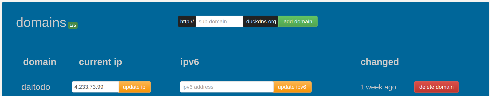

# DAI TODO API

> A RESTful API for managing tasks and task lists with HTTP caching support.

## Authors

- [Santiago Sugrañes](https://github.com/santettebtw)
- [Maxime Regenass](https://github.com/maxregenassPro)

## Table of Contents

- [Overview](#overview)
- [API Documentation](#api-documentation)
- [Caching Strategy](#caching-strategy)
- [Infrastructure Setup](#infrastructure-setup)
  - [Virtual Machine Setup](#virtual-machine-setup)
  - [DNS Configuration](#dns-configuration)
  - [Deployment with Docker Compose](#deployment-with-docker-compose)
- [Usage Examples](#usage-examples)

## Overview

**Key Features:**
- Task management with priorities (LOW, MEDIUM, HIGH) and statuses (TODO, DOING, DONE)
- Task list organization for grouping related tasks
- Query parameter filtering (by status, priority, due date)
- HTTP validation caching with `Last-Modified` headers
- Data persistence using json

## API Documentation

The API provides two main resources:

**Tasks Resource (`/tasks`):** Manage individual to-do items with descriptions, due dates, priorities (LOW, MEDIUM, HIGH), and statuses (TODO, DOING, DONE). Supports filtering by status, priority, and due date.

**Task Lists Resource (`/tasklists`):** Organize tasks into named collections. Supports filtering by name.

> **Complete API Reference:** [API_DOCUMENTATION.md](./API_DOCUMENTATION.md)

## Caching Strategy

We implement **HTTP validation caching** using the `Last-Modified` header.

### How It Works

- Each resource stores a `Last-Modified` timestamp in a `ConcurrentHashMap`
- Collections use ID `-1` to track when any item in the collection changes
- Server returns `304 Not Modified` when data hasn't changed since the client's last request
- Server returns `412 Precondition Failed` to prevent lost updates from concurrent modifications

### HTTP Headers

| Header | Usage | Result |
|--------|-------|--------|
| `Last-Modified` | Server sends modification time | Included in all GET/POST/PUT responses |
| `If-Modified-Since` | Client checks if GET data changed | `304` if unchanged, `200` if changed |
| `If-Unmodified-Since` | Client ensures no conflicts on PUT/DELETE | `412` if modified, `200`/`204` if successful |

### Example Workflow

```bash
# 1. Get a task (server returns Last-Modified header)
curl -i https://daitodo.duckdns.org/tasks/1
# Returns: Last-Modified: 2026-01-20T10:32:14

# 2. Request again with cache validation
curl -i -H "If-Modified-Since: 2026-01-20T10:32:14" \
  https://daitodo.duckdns.org/tasks/1
# Returns: HTTP/1.1 304 Not Modified (no body, saves bandwidth)

# 3. Update with conditional request
curl -X PUT -H "If-Unmodified-Since: 2026-01-20T10:32:14" \
  -H "Content-Type: application/json" \
  -d '{"description":"Updated","dueDate":"2026-01-25","priority":"HIGH","status":"DOING"}' \
  https://daitodo.duckdns.org/tasks/1
# Returns: 200 OK (or 412 if someone else modified it first)
```

## Infrastructure Setup

### Virtual Machine Setup

We obtained a virtual machine running **Ubuntu 22.04 LTS** and configured it following the [HEIG-VD DAI Course SSH and SCP guide](https://github.com/heig-vd-dai-course/heig-vd-dai-course/blob/main/11.03-ssh-and-scp/01-course-material/README.md).

**Configuration steps:**
1. Created VM on Azure cloud provider
2. Configured SSH key authentication
3. Opened ports 22 (SSH), 80 (HTTP), and 443 (HTTPS)
4. Installed Docker and Docker Compose

**SSH Access:**
```bash
ssh ubuntu@4.233.73.99
```

### DNS Configuration

We used **[Duck DNS](https://www.duckdns.org/)** as our DNS provider following the [Web Infrastructures course material](https://github.com/heig-vd-dai-course/heig-vd-dai-course/blob/main/13.01-web-infrastructures/01-course-material/README.md#obtain-a-domain-name).

**Domain:** `daitodo.duckdns.org`

Duck DNS automatically creates both the main `A` record and a wildcard `*` record when you add a domain, allowing both the main domain and all subdomains to resolve to the VM.



**DNS Records:**

| Record Type | Hostname | Points To | Purpose |
|-------------|----------|-----------|---------|
| A | `daitodo.duckdns.org` | `4.233.73.99` | Main API endpoint |
| A (wildcard) | `*.daitodo.duckdns.org` | `4.233.73.99` | All subdomains (ex. Traefik dashboard) |

**Verify DNS resolution:**
```bash
nslookup daitodo.duckdns.org
nslookup traefik.daitodo.duckdns.org
```

### Deployment with Docker Compose

Our deployment uses [Traefik](https://traefik.io/) as a reverse proxy with automatic HTTPS via [Let's Encrypt](https://letsencrypt.org/), following the [Web Infrastructures course examples](https://github.com/heig-vd-dai-course/heig-vd-dai-course/tree/main/13.01-web-infrastructures/02-code-examples).

#### Architecture

**Components:**
- **Traefik:** Handles HTTP→HTTPS redirect, TLS certificate generation/renewal, request routing
- **DAI TODO API:** Runs on internal port 8080, accessible via `https://daitodo.duckdns.org`
- **Shared Network:** `traefik_network` connects both services

#### Project Structure

**Repository (`docker-files/`):**
```
docker-files/
├── traefik/
│   ├── docker-compose.yaml
│   └── .env
└── api/
    ├── docker-compose.yaml
    └── .env
```

**Server (`~/`):**
```
~/
├── traefik/
│   ├── docker-compose.yaml
│   ├── .env
│   └── letsencrypt/           # Auto-generated certificates
└── api/
    ├── docker-compose.yaml
    ├── .env
    └── data/
        └── data.json          # Auto-generated persistent data
```

#### Deployment Steps

**1. Copy configuration files to the server:**

```bash
# From local machine
scp docker-files/traefik/docker-compose.yaml ubuntu@4.233.73.99:~/traefik/
scp docker-files/traefik/.env ubuntu@4.233.73.99:~/traefik/
scp docker-files/api/docker-compose.yaml ubuntu@4.233.73.99:~/api/
scp docker-files/api/.env ubuntu@4.233.73.99:~/api/
```

**2. SSH into the server:**

```bash
ssh ubuntu@4.233.73.99
```

**3. Start Traefik (creates the shared network):**

```bash
docker compose -f ~/traefik/docker-compose.yaml up -d
```

**4. Start the API:**

```bash
cd ~/api
docker compose pull  # Pull latest image from GitHub Container Registry
docker compose up -d
```

**5. Verify deployment:**

```bash
# Check running containers
docker ps

# Check logs
docker compose -f ~/traefik/docker-compose.yaml logs -f
docker compose -f ~/api/docker-compose.yaml logs -f
```

**6. Access the application:**

- **API:** https://daitodo.duckdns.org
- **Traefik Dashboard:** https://traefik.daitodo.duckdns.org

*Wait 1-2 minutes for Let's Encrypt certificates on first deployment.*

#### Environment Variables

**Traefik (`traefik/.env`):**
```env
TRAEFIK_IMAGE_VERSION=v2.11
TRAEFIK_ENABLE_DASHBOARD=true
TRAEFIK_ACME_EMAIL=santiago.sugranes@heig-vd.ch
TRAEFIK_FULLY_QUALIFIED_DOMAIN_NAME=traefik.daitodo.duckdns.org
```

**API (`api/.env`):**
```env
APP_FQDN=daitodo.duckdns.org
GITHUB_USERNAME=santettebtw
```

#### Updating the Application

When code changes are made:

```bash
# Local: Build and push new image
./mvnw clean package
docker build -t ghcr.io/santettebtw/dai-todo-api:latest .
docker push ghcr.io/santettebtw/dai-todo-api:latest

# Server: Pull and restart
ssh ubuntu@4.233.73.99
cd ~/api
docker compose pull
docker compose up -d
```

## Usage Examples

All examples use the **deployed application** at `https://daitodo.duckdns.org`.

### Tasks Examples

**Create a task:**

```bash
curl -X POST -H "Content-Type: application/json" \
  -d '{"description":"Write project report","dueDate":"2026-01-25","priority":"HIGH","status":"TODO"}' \
  https://daitodo.duckdns.org/tasks
```

Response:
```json
{
  "id": 1,
  "description": "Write project report",
  "dueDate": "2026-01-25",
  "priority": "HIGH",
  "status": "TODO"
}
```

**Get all tasks:**

```bash
curl https://daitodo.duckdns.org/tasks
```

**Get a specific task:**

```bash
curl https://daitodo.duckdns.org/tasks/1
```

**Filter tasks by status:**

```bash
curl https://daitodo.duckdns.org/tasks?status=TODO
```

**Filter tasks by priority:**

```bash
curl https://daitodo.duckdns.org/tasks?priority=HIGH
```

**Filter tasks by due date:**

```bash
curl https://daitodo.duckdns.org/tasks?dueDate=2026-01-25
```

**Filter tasks with multiple criteria (AND logic):**

```bash
curl "https://daitodo.duckdns.org/tasks?status=TODO&priority=HIGH"
```

**Update a task:**

```bash
curl -X PUT -H "Content-Type: application/json" \
  -d '{"description":"Write project report","dueDate":"2026-01-25","priority":"HIGH","status":"DOING"}' \
  https://daitodo.duckdns.org/tasks/1
```

**Delete a task:**

```bash
curl -X DELETE -i https://daitodo.duckdns.org/tasks/1
```

Response:
```
HTTP/1.1 204 No Content
```

### Task Lists Examples

**Create a task list:**

```bash
curl -X POST -H "Content-Type: application/json" \
  -d '{"name":"Personal Projects","taskIds":[1]}' \
  https://daitodo.duckdns.org/tasklists
```

Response:
```json
{
  "id": 1,
  "name": "Personal Projects",
  "tasks": []
}
```

**Create a task list with tasks:**

```bash
curl -X POST -H "Content-Type: application/json" \
  -d '{"name":"Work Tasks","taskIds":[1,2]}' \
  https://daitodo.duckdns.org/tasklists
```

Response:
```json
{
  "id": 2,
  "name": "Work Tasks",
  "tasks": [
    {
      "id": 1,
      "description": "Write project report",
      "createdAt": "2026-01-20",
      "dueDate": "2026-01-25",
      "priority": "HIGH",
      "status": "TODO"
    },
    {
      "id": 2,
      "description": "Review code",
      "createdAt": "2026-01-20",
      "dueDate": "2026-01-23",
      "priority": "MEDIUM",
      "status": "DOING"
    }
  ]
}
```

**Get all task lists:**

```bash
curl https://daitodo.duckdns.org/tasklists
```

**Get a specific task list:**

```bash
curl https://daitodo.duckdns.org/tasklists/1
```

**Filter task lists by name:**

```bash
curl https://daitodo.duckdns.org/tasklists?name=Personal
```

**Update a task list:**

```bash
curl -X PUT -H "Content-Type: application/json" \
  -d '{"name":"Work Projects","taskIds":[1,3,5]}' \
  https://daitodo.duckdns.org/tasklists/1
```

**Delete a task list:**

```bash
curl -X DELETE -i https://daitodo.duckdns.org/tasklists/1
```

### Caching Examples

**Using If-Modified-Since:**

```bash
# First request - get the Last-Modified header
curl -i https://daitodo.duckdns.org/tasks/1

# Second request - use the timestamp from Last-Modified
curl -i -H "If-Modified-Since: 2026-01-20T15:30:00" \
  https://daitodo.duckdns.org/tasks/1
# Returns 304 Not Modified if unchanged
```

**Using If-Unmodified-Since:**

```bash
# Conditional update - only succeeds if resource hasn't changed
curl -X PUT -H "If-Unmodified-Since: 2026-01-20T15:30:00" \
  -H "Content-Type: application/json" \
  -d '{"description":"Updated task","dueDate":"2026-01-26","priority":"MEDIUM","status":"DOING"}' \
  https://daitodo.duckdns.org/tasks/1
# Returns 412 Precondition Failed if someone else modified it
```
